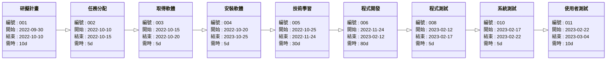

# 組員名單:
| 職位 | 姓名 | 學號 | 
| :-----: | :-----: | :---: |
| 組長 | [彭晨燿](https://github.com/David74091/2022-3a/blob/main/README.md) | C109190145 
| 組員 | [劉芷林](https://github.com/liuzl0121/2022-3A/blob/main/README.md) | C109190146 | 
| 組員 | [曹芷瑄](https://github.com/yummikawaii1001/2022-3A/blob/main/README1.md) | C109193145 | 
| 組員 | [陳惜恩](https://github.com/ianchen123/2022-3a/blob/main/README.md)| C109118183 |
---

# 任務分配:
| 姓名 | 任務 |
| :---: | --- |
| 彭晨燿 | 研擬計畫、任務分配、取得軟體、安裝軟體、技術學習、撰寫使用手冊、程式開發、程式測試、系統測試 |
| 劉芷林 | 研擬計畫、取得軟體、安裝軟體、技術學習、使用者訓練、使用者測試 |
| 曹芷瑄 | 研擬計畫、取得軟體、安裝軟體、技術學習、使用者訓練、使用者測試 |
| 陳惜恩 | 研擬計畫、技術學習、取得軟體、安裝軟體、撰寫使用手冊、程式開發、程式測試、系統測試 |

---

# 甘特圖:

```mermaid
gantt
    title 甘特圖
    dateFormat  YYYY-MM-DD
    section 所有任務
    研擬計畫: a1, 2022-09-30, 10d
    任務分配: a2,after a1, 5d
    取得軟體: a3, after a2, 5d
    安裝軟體: a4, after a3, 5d
    技術學習: a5, after a4, 30d
    程式開發: a6, after a5, 80d
    撰寫使用手冊: a7, after a6, 25d
    程式測試: a8, after a6, 5d
    系統測試: a9, after a8, 5d
    使用者訓練: a10, after a7, 3d
    使用者測試: a11, after a10, 10d 
    section 彭晨燿
    研擬計畫: a1, 2022-09-30, 10d
    任務分配: a2,after a1, 5d
    取得軟體: a3, after a2, 5d
    安裝軟體: a4, after a3, 5d
    技術學習: a5, after a4, 30d
    程式開發: a6, after a5, 80d
    撰寫使用手冊: a7, after a6, 25d
    程式測試: a8, after a6, 5d
    系統測試: a9, after a8, 5d
    使用者訓練: a10, after a7, 3d
    section 劉芷林
    研擬計畫: a1, 2022-09-30, 10d
    取得軟體: a3, after a2, 5d
    安裝軟體: a4, after a3, 5d
    技術學習: a5, after a4, 30d
    程式開發: a6, after a5, 80d
    使用者測試: a11, after a10, 10d 
    section 曹芷瑄
    研擬計畫: a1, 2022-09-30, 10d
    取得軟體: a3, after a2, 5d
    安裝軟體: a4, after a3, 5d
    技術學習: a5, after a4, 30d
    程式開發: a6, after a5, 80d
    使用者測試: a11, after a10, 10d 
    section 陳昔恩
    研擬計畫: a1, 2022-09-30, 10d
    取得軟體: a3, after a2, 5d
    安裝軟體: a4, after a3, 5d
    技術學習: a5, after a4, 30d
    程式開發: a6, after a5, 80d
    撰寫使用手冊: a7, after a6, 25d
    程式測試: a8, after a6, 5d
    系統測試: a9, after a8, 5d
    使用者訓練: a10, after a7, 3d
   ```
---

# Pert圖與關鍵路徑:
```mermaid

classDiagram
  direction LR

  
  class 研擬計畫 {
    編號 : 001
    開始 : 2022-09-30
    結束 : 2022-10-10
    需時 : 10d
  }
  class 任務分配{
    編號 : 002
    開始 : 2022-10-10
    結束 : 2022-10-15
    需時 : 5d
  }
  class 取得軟體{
    編號 : 003
    開始 : 2022-10-15
    結束 : 2022-10-20
    需時 : 5d
  }
  class 安裝軟體{
    編號 : 004
    開始 : 2022-10-20
    結束 : 2023-10-25
    需時 : 5d
  }
  class 技術學習{
    編號 : 005
    開始 : 2022-10-25
    結束 : 2022-11-24
    需時 : 30d
  }
  class 程式開發{
    編號 : 006
    開始 : 2022-11-24
    結束 : 2023-02-12
    需時 : 80d
  }
  class 撰寫使用手冊{
    編號 : 007
    開始 : 2022-11-24
    結束 : 2022-12-19
    需時 : 25d
  }
  class 程式測試{
    編號 : 008
    開始 : 2023-02-12
    結束 : 2023-02-17
    需時 : 5d
  }
  class 使用者訓練{
    編號 : 009
    開始 : 2022-12-19
    結束 : 2023-12-22
    需時 : 3d
  }
  class 系統測試{
    編號 : 010
    開始 : 2023-02-17
    結束 : 2023-02-22
    需時 : 5d
  }
  class 使用者測試{
    編號 : 011
    開始 : 2023-02-22
    結束 : 2023-03-04
    需時 : 10d
  }
  
  
  研擬計畫 --|> 任務分配 
  任務分配 --|> 取得軟體
  取得軟體 --|> 安裝軟體
  安裝軟體 --|> 技術學習
  技術學習 --|> 程式開發
  技術學習 --|> 撰寫使用手冊
  程式開發 --|> 程式測試
  撰寫使用手冊 --|> 使用者訓練
  程式測試 --|> 系統測試
  系統測試 --|> 使用者測試
  使用者訓練 --|> 使用者測試
```
## 關鍵路徑:


